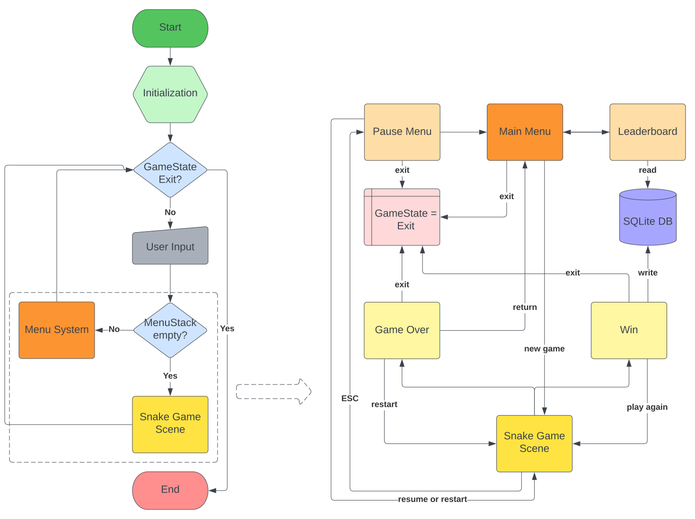

# Snake Game Design
This is a design for snake game. It contains a simple menu nevigation system, a SQLite DB to store leaderboard information, and the game scene for snake game play.

## Menu System
Menus are maintained in a stack. It follows below principles.
- When the program starts, main menu is pushed to the stack.
- During the game loop, if the menu stack is not empty, the top of the stack will be rendered and need to handle user input.
- When a new game starts, the menu stack is cleared and user input will be routed to game scene.
- When the game is paused, a pause menu is pushed to the menu stack.
- There is always a way to route back to the main menu from any menu.

## Game Play
- There are 15 levels. The higher the level, the faster the snake.
- Snake must eat 15 apples to move to the next level.
- Press and hold makes the snake move with max speed.
- The snake has 3 lives.
- Press `ESC` button to pause the game.
- Player can leave its name after all levels are passed and it will show up in leaderboard.

## High Level Diagram
